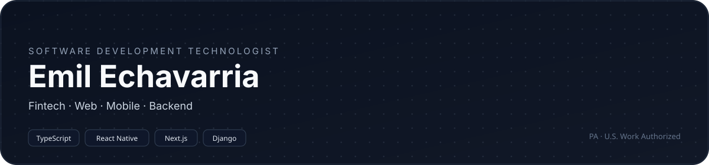
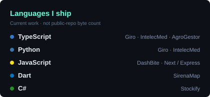
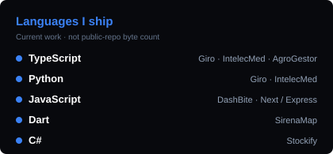

  

 

 

---

## About

Junior Systems Engineer at **Giro Crédito** (fintech, Santo Domingo — remote). I ship production features across the mobile app, web portal, and backend.

Academic capstone: a 6-service microservices medical platform with applied ML and OpenAI. 2nd place at the **AlphaRamos Retail Hackathon** with SirenaMap — indoor navigation using ESP32 beacons and trilateration.

- Building **AgroGestor**, an agricultural SaaS with an AI assistant
- **ITLA** — graduating October 2026 · GPA 3.8/4.0
- Spanish (native) · English (intermediate)
- **PA** · U.S. Work Authorized · No sponsorship required

---

## Experience

<table>
<tr>
<td width="8" bgcolor="#64FFDA"></td>
<td valign="top">

### Junior Systems Engineer · Giro Crédito
`Jul 2026 — Present` · Full-time · Remote · Santo Domingo, DR
&nbsp;&nbsp;

Fintech. Production work across **three codebases**.

**Mobile** — React Native, Expo, TypeScript. Loan and collections UX: Giro Cuotas, Giro Solidario, Friends & Family, Giro Puntos (referrals, points, checkout redemption), KYC, Plan de Pago, bank-account confirmation, and zero-interest extensions. Home-screen UI refresh. Maestro E2E for auth, forms, loans, and payments.

**Web** — Next.js, React, TypeScript, Tailwind. Public referral landing with app-download tracking, KYC improvements, MDX blog, brand updates, and Meta / UTM attribution.

**Backend** — Python, Django, Django Ninja. REST APIs for loan re-offers, deep links (WhatsApp / push / SMS / email), Meta Conversions API, and Giro Cobros — multichannel collections (push, WhatsApp, SMS, email, voice).

Cross-board: API contracts, edge cases, and production releases.

`TypeScript` `React Native` `Expo` `Next.js` `Python` `Django` `PostgreSQL` `Celery` `Redis` `AWS`

</td>
</tr>
</table>

---

## Tech Stack

  

 

**Also:** Expo · Celery · Railway · OpenAI · scikit-learn · XGBoost

---

## Featured Projects

<table>
<tr>
<td width="50%" valign="top">

### [IntelecMed](https://github.com/EmilEchavarria/intelecmed) — CDSS
**NestJS · FastAPI · Next.js · PostgreSQL · MongoDB · Docker · AWS S3 · OpenAI · scikit-learn · XGBoost**

Academic capstone. Microservices Clinical Decision Support System with 6 independent services. RandomForest + XGBoost for cardiovascular and diabetes risk. Five GPT features: RAG over patient records, AI triage, 6-month forecast, and clinical document Vision. RBAC, JWT rotation, brute-force detection.

`Microservices` `Machine Learning` `HealthTech` `AI`

</td>
<td width="50%" valign="top">

### AgroGestor *(In Progress)*
**Next.js · Express.js · PostgreSQL · Tailwind · Railway · OpenAI**

Agricultural SaaS for crop control, inventory, sales, and expenses. Tiered plans (Basic, Pro, Enterprise) with RBAC. “Oli” — AI assistant for pest management and real-time farm support.

`SaaS` `Full-Stack` `AI Integration` `Agriculture`

</td>
</tr>
<tr>
<td width="50%" valign="top">

### SirenaMap
**Flutter · ESP32 · BLE · Trilateration**

2nd place — AlphaRamos Retail Hackathon. Indoor GPS for supermarkets with ESP32 beacons and trilateration (~±2 m). Lead on mobile, IoT, and landing.

`Hackathon` `IoT` `Mobile` `Indoor Navigation`

</td>
<td width="50%" valign="top">

### DashBite
**Express.js · Handlebars · JavaScript · Tailwind · MySQL · Railway**

Food ordering platform for clients, businesses, and drivers. Login, catalogs, order tracking, reports, and admin panels.

`Full-Stack` `REST APIs` `Dashboard`

</td>
</tr>
</table>

---

## GitHub Stats

  
  

---

## Highlights

<table>
<tr>
<td align="center" width="56">🏦</td>
<td><strong>Junior Systems Engineer — Giro Crédito</strong> Fintech · Production · React Native · Next.js · Django</td>
<td align="right"></td>
</tr>
<tr>
<td align="center" width="56">🎓</td>
<td><strong>ITLA — Technologist in Software Development</strong> GPA 3.8 / 4.0 · Graduating October 2026</td>
<td align="right"></td>
</tr>
<tr>
<td align="center" width="56">🏆</td>
<td><strong>2nd Place — AlphaRamos Retail Hackathon</strong> SirenaMap · ESP32 beacons · indoor navigation · ±2m</td>
<td align="right"></td>
</tr>
</table>
